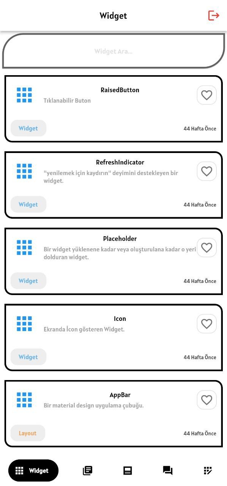
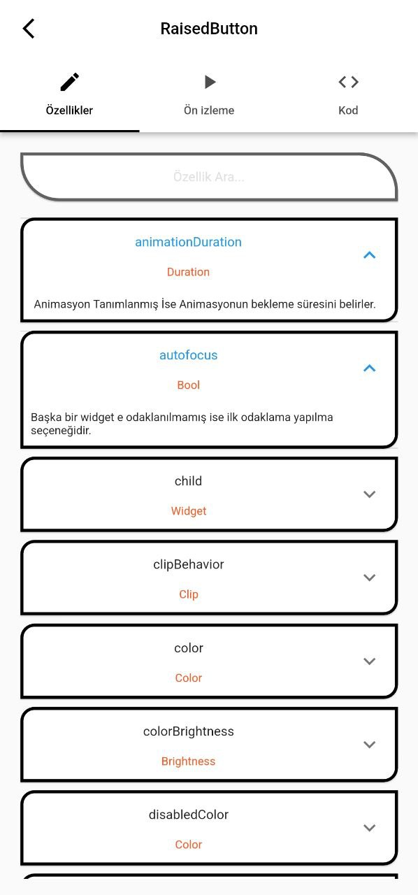
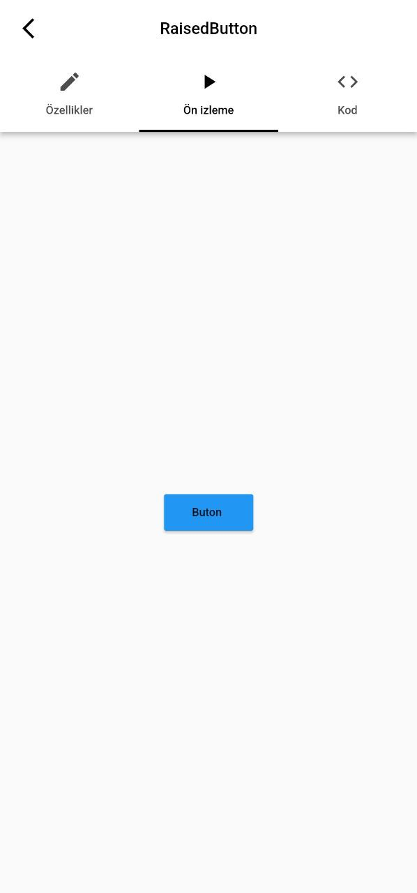
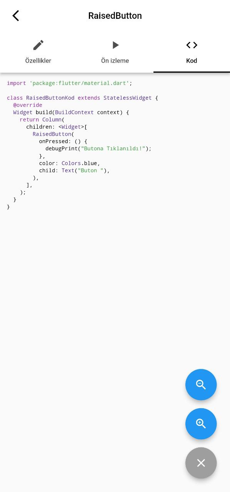
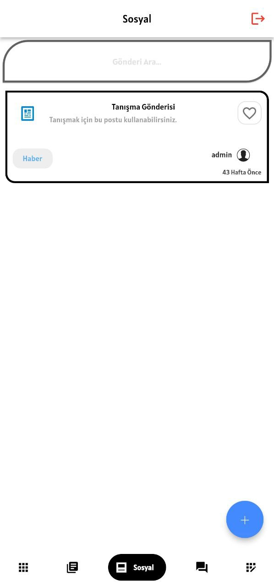
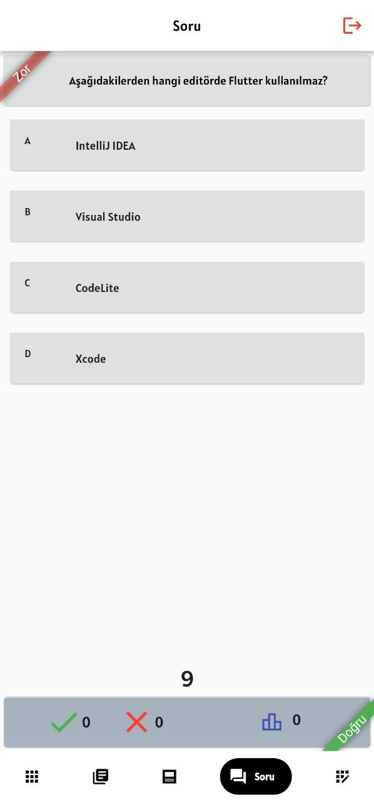
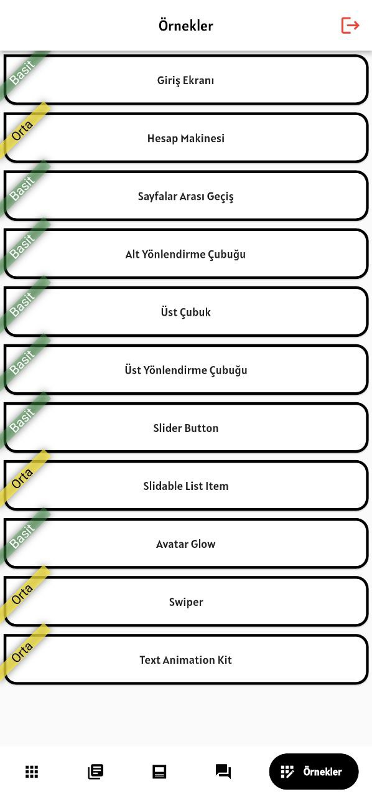
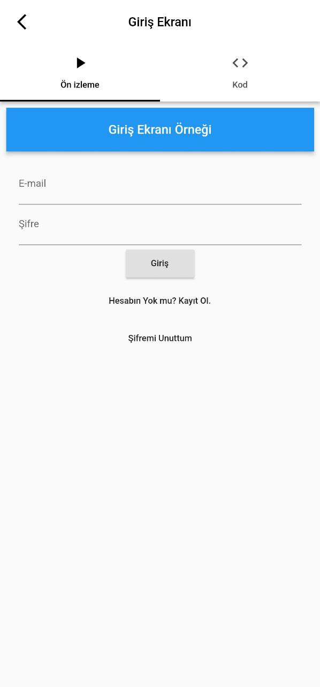
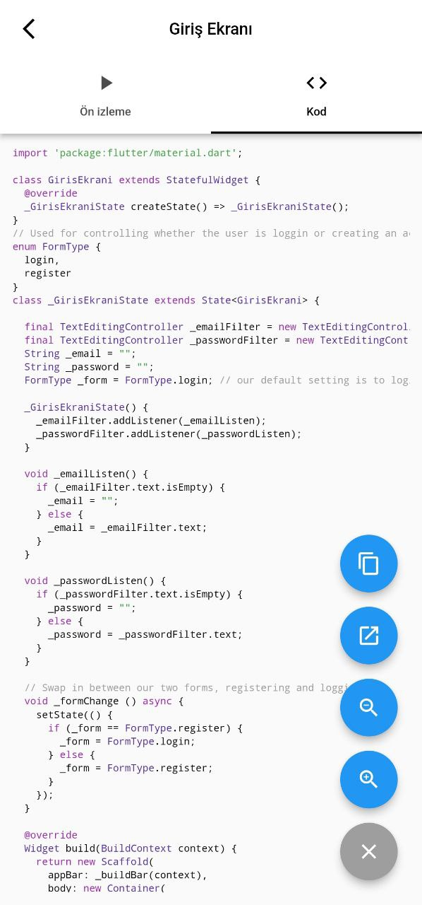

# Hızlı Flutter Project

A Hızlı Flutter project created in flutter using GetX. Hızlı Flutter supports both web, desktop and  mobile.

## Getting Started
[Play Store](https://play.google.com/store/apps/details?id=com.yazilimmotoru.hizliflutter)
<p>
  
   
  
</p>
<p>
  
   
  
</p>
<p>
  
   
  
</p>


## How to Use 

**Step 1:**

Download or clone this repo by using the link below:

```
https://github.com/mustafaozdemiir/hizli_flutter.git
```

**Step 2:**

Go to project root and execute the following command in console to get the required dependencies: 

```
flutter pub get 
```

**Step 3:**

This project uses `inject` library that works with code generation, execute the following command to generate files:

```
flutter packages pub run build_runner build --delete-conflicting-outputs
```

or watch command in order to keep the source code synced automatically:

```
flutter packages pub run build_runner watch
```

## Hide Generated Files

In-order to hide generated files, navigate to `Android Studio` -> `Preferences` -> `Editor` -> `File Types` and paste the below lines under `ignore files and folders` section:

```
*.inject.summary;*.inject.dart;*.g.dart;
```

In Visual Studio Code, navigate to `Preferences` -> `Settings` and search for `Files:Exclude`. Add the following patterns:
```
**/*.inject.summary
**/*.inject.dart
**/*.g.dart
```

## Hızlı Flutter Features:

* Splash
* Login
* Home
* Game
* Examples
* News
* Database
* GetX (State Management)
* User Notifications


### Up-Coming Features:

* Dark Theme Support
* Multilingual Support

### Libraries & Tools Used

* [widget_with_codeview](https://github.com/X-Wei/widget_with_codeview)
* [youtube_player_flutter](https://github.com/sarbagyastha/youtube_player_flutter/tree/master/packages/youtube_player_flutter)
* [youtube_player_iframe](https://github.com/sarbagyastha/youtube_player_flutter)
* [GetX](https://github.com/jonataslaw/getx) (State Management)
* [Cached network image](https://github.com/Baseflow/flutter_cached_network_image)
* [firebase_messaging](https://github.com/firebase/flutterfire/tree/master/packages/firebase_messaging/firebase_messaging)
* [google_nav_bar](https://github.com/sooxt98/google_nav_bar)
* [slider_button](https://github.com/anirudhsharma392/Slider-Button)
* [flutter_slidable](https://github.com/letsar/flutter_slidable)
* [avatar_glow](https://github.com/apgapg/avatar_glow)
* [flutter_swiper](https://github.com/best-flutter/flutter_swiper)
* [animated_text_kit](https://github.com/aagarwal1012/Animated-Text-Kit/)
* [timeago](https://github.com/andresaraujo/timeago.dart)
* [animated_floatactionbuttons](https://github.com/jhontona/animated-floatbuttons)
* [shimmer](https://github.com/hnvn/flutter_shimmer)
* [animation_wrappers](https://github.com/jagritjkh/animation_wrappers)

### Folder Structure
Here is the core folder structure which flutter provides.

```
flutter-app/
|- android
|- assests
|- ios
|- lib
|- res
|- test
|- web
```

Here is the folder structure we have been using in this project

```
lib/
|- controllers/
|- data/
|- kodlar/
|- models/
|- pages/
|- services/
|- app_string.dart
|- generated_plugin_registrant.dart
|- main.dart
```


## Conclusion

I will be happy to answer any questions that you may have on this approach, and if you want to lend a hand with the Hızlı Flutter then please feel free to submit an issue and/or pull request 🙂

Again to note, this is example can appear as over-architectured for what it is - but it is an example only. If you liked my work, don’t forget to ⭐ star the repo to show your support.

